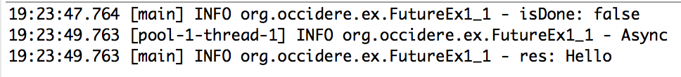
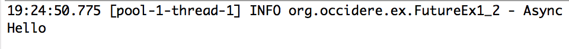
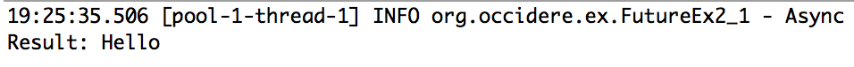
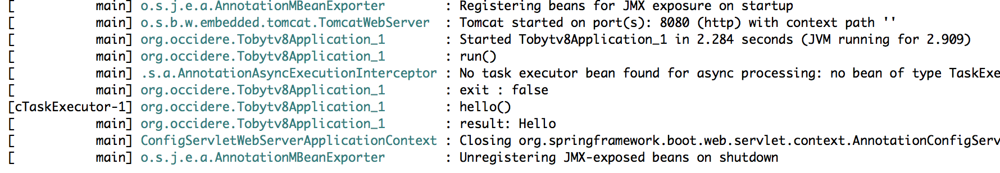
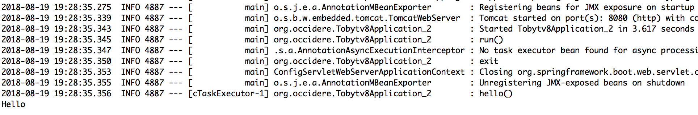
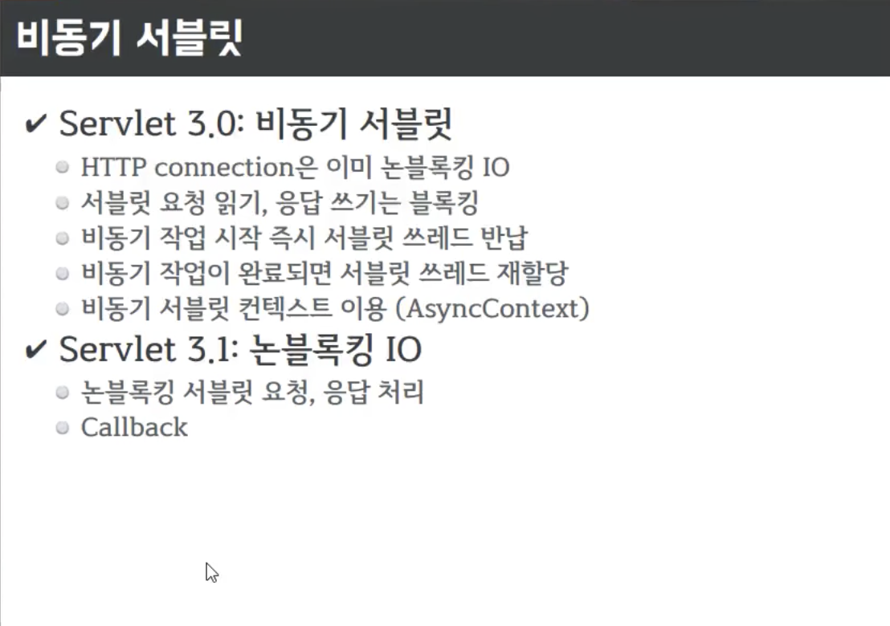
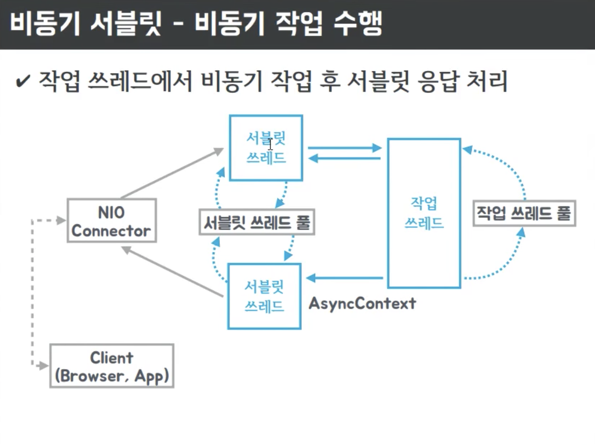
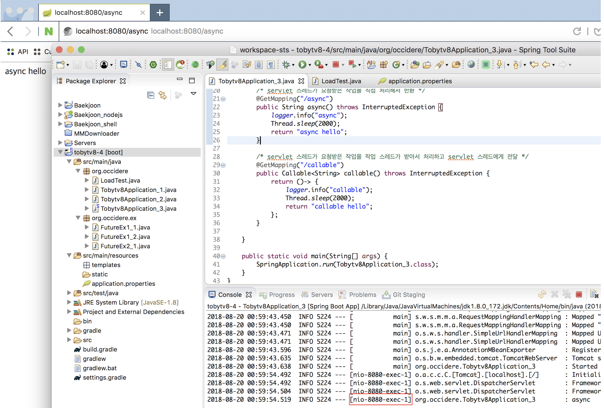
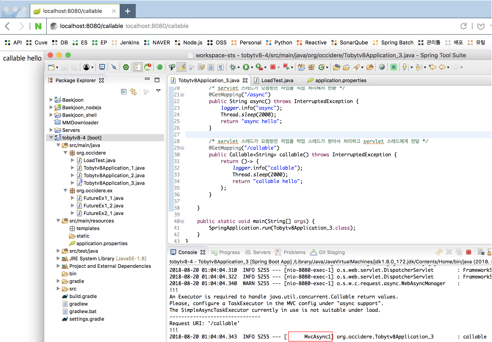
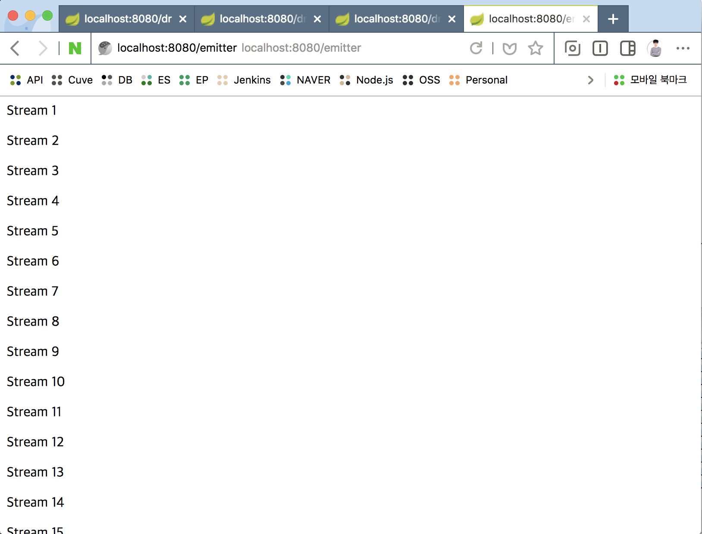

# 자바와 스프링의 비동기 기술

## Link: https://youtu.be/aSTuQiPB4Ns

## 목차

1. 비동기 처리시 결과값을 리턴받는 방법

   1. 전통적인 Java 방식

      * Future
      * Callback (Listener)

   2. Spring boot의 방식

      * 어노테이션 사용 /w Future
      * 어노테이션 사용 /w ListenableFuture

2. Spring의 비동기 처리를 Web에 적용

    * 비동기 서블릿
    * worker 스레드를 생성하지 않고 동시에 다중 요청을 처리하는 방법
    * DeferredResult (Event 방식)
    * Emitter (Stream 방식)

          

---


## 비동기 처리 시 결과값을 리턴받는 방법


### 전통적인 Java 방식

1. **Future**

   결과값을 리턴받지 않는 Runnble 인터페이스와는 달리, 
   결과값을 넘겨주는 Callable 인터페이스의 결과를 받아주는 인터페이스.

   [FutureEx1_1]

   ````java
   public static void main(String[] args) throws Exception {
       ExecutorService es = Executors.newCachedThreadPool();
   
       // 결과값을 받아올 땐, Runnable이 아닌 Callable
       Future<String> f = es.submit(()-> {
           Thread.sleep(2000);
           logger.info("Async");
           return "Hello";
       });
   
       logger.info("isDone: {}", f.isDone());
       logger.info("res: {}", f.get()); // Blocking 방식!
   
       es.shutdown();
   }
   ````

   [결과]

   

   -> **Blocking 방식의 한계**가 있음

   

   

2. **Callback**

   Future 인터페이스를 구현한 FutureTask를 활용
   

   **FutureTask?**

   * 내부에 done() 메서드가 있어서, get()을 통해 결과를 받아올 수 있음
   
     [FutureEx1_2]

     ````java
     public static void main(String[] args) throws Exception {
         ExecutorService es = Executors.newCachedThreadPool();
     
         // Future 인터페이스의 구현체 
         FutureTask<String> f = new FutureTask<String>(()-> {
             Thread.sleep(2000);
             logger.info("Async");
             return "Hello";
         }) {
             @Override
             protected void done() {	// FutureTask 내부에 done()이 있어서 
                 try {
                     System.out.println(get()); // get() 을 통한 결과를 받아올 수 있다. 
                 } catch(InterruptedException e) {
                     Thread.currentThread().interrupt();
                 } catch(ExecutionException e) {
                     e.printStackTrace();
                 }
             }
         };
     
         es.execute(f);
         es.shutdown();
     }
     ````

     [결과]

     

   

   

   이를 활용하여 Callback을 직접 작성.

   **[FutureEx2_1]**

   ````java
   @FunctionalInterface
   interface SuccessCallback {
       void onSuccess(String result);
   }
   
   @FunctionalInterface
   interface ExceptionCallback {
       void onError(Throwable t);
   }
   
   public static class CallbackFutureTask extends FutureTask<String> {
       SuccessCallback sc;
       ExceptionCallback ec;
   
       public CallbackFutureTask(Callable<String> callable, SuccessCallback sc, ExceptionCallback ec) {
           super(callable);
           this.sc = Objects.requireNonNull(sc); // 자동 Null check
           this.ec = Objects.requireNonNull(ec);
       }
   
       @Override
       protected void done() { // FutureTask 내의 done()
           try {
               sc.onSuccess(get()); // get() 으로 결과값 호출. 
           } catch(InterruptedException e) {
               // 종료 시그널이긴 하나, 강제성은 없음 -> 현재 스레드에게 인터럽트를 직접 줌.
               Thread.currentThread().interrupt();
           } catch(ExecutionException e) {
               ec.onError(e); // 발생한 예외를 호출한 곳으로 넘김. 
           }
       }
   }
   
   
   public static void main(String[] args) throws Exception {
       ExecutorService es = Executors.newCachedThreadPool();
   
       CallbackFutureTask f = new CallbackFutureTask(()-> {
           Thread.sleep(2000);
           logger.info("Async");
   
   //		if(true) throw new RuntimeException("Error!");
   
           return "Hello";
       },
       	s-> System.out.println("Result: " + s),
           e-> System.err.println("Error: " + e.getMessage()));
   
       es.execute(f);
       es.shutdown();
   }
   ````

   [결과]

   


---


## Spring Boot에서의 비동기 처리 방식


### @EnableAsync & @Async 어노테이션 사용

우선 Future 를 사용해 비동기 처리 결과를 리턴받는 방법을 살펴본다.

[Tobytv8Application_1]

````java
package org.occidere;

import java.util.concurrent.Future;

import org.slf4j.Logger;
import org.slf4j.LoggerFactory;
import org.springframework.beans.factory.annotation.Autowired;
import org.springframework.boot.ApplicationRunner;
import org.springframework.boot.SpringApplication;
import org.springframework.boot.autoconfigure.SpringBootApplication;
import org.springframework.context.ConfigurableApplicationContext;
import org.springframework.context.annotation.Bean;
import org.springframework.scheduling.annotation.Async;
import org.springframework.scheduling.annotation.AsyncResult;
import org.springframework.scheduling.annotation.EnableAsync;
import org.springframework.stereotype.Component;

@SpringBootApplication
@EnableAsync
public class Tobytv8Application_1 {
	static Logger logger = LoggerFactory.getLogger(Tobytv8Application_1.class);
	
	@Component
	public static class MyService {
		@Async
		public Future<String> hello() throws InterruptedException { // 리턴 타입이 Future
			logger.info("hello()"); // main 스레드가 아닌 다른 별도의 스프링 스레드에서 실행됨. 
			Thread.sleep(2000);
			return new AsyncResult<>("Hello"); // AsyncResult 로 감싸서 리턴. 
		}
	}
	
	@Autowired
	MyService myService;
	
	@Bean
	ApplicationRunner run() {
		return args -> {
			logger.info("run()");
			Future<String> f = myService.hello();
			logger.info("exit : {}", f.isDone());
			logger.info("result: {}", f.get); // web으로 생각하면 servlet thread가 결과값을 받기 전 까지 종료되지 못하고 계속 대기 상태에 있는 상황
		};
	}
	

	public static void main(String[] args) {
		try(ConfigurableApplicationContext c = SpringApplication.run(Tobytv8Application_1.class, args)){
		}
	}
}

````

[결과]



그러나 이 방식 역시 Future를 사용한 것이라 비 동기적으로 작업이 이뤄지기는 하나, 결과값을 얻기 위해선 블로킹 상태로 대기해야 됨 
(web으로 생각하면 servlet thread가 결과값을 받기 전 까지 종료되지 못하고 계속 대기 상태에 있는 상황)

-> 결과값 역시 블로킹 없이 리스너 처럼 받을 수 있는 방법?


### ListenableFuture

이전에 살펴본 Callback 처럼 Spring 에서도 시간이 오래 걸리는 작업의 결과값을
리스너를 활용하여 비동기적으로 받을 수 있는 방법.

**[Tobytv8Application_2]**

````java
package org.occidere;

import org.slf4j.Logger;
import org.slf4j.LoggerFactory;
import org.springframework.beans.factory.annotation.Autowired;
import org.springframework.boot.ApplicationRunner;
import org.springframework.boot.SpringApplication;
import org.springframework.boot.autoconfigure.SpringBootApplication;
import org.springframework.context.ConfigurableApplicationContext;
import org.springframework.context.annotation.Bean;
import org.springframework.scheduling.annotation.Async;
import org.springframework.scheduling.annotation.AsyncResult;
import org.springframework.scheduling.annotation.EnableAsync;
import org.springframework.stereotype.Component;
import org.springframework.util.concurrent.ListenableFuture;

@SpringBootApplication
@EnableAsync
public class Tobytv8Application_2 {
	static Logger logger = LoggerFactory.getLogger(Tobytv8Application_2.class);
	
	@Component
	public static class MyService {
		@Async
		public ListenableFuture<String> hello() throws InterruptedException { // 리턴 타입이 ListenableFuture
			logger.info("hello()"); // main 스레드가 아닌 다른 별도의 스프링 스레드에서 실행됨. 
			Thread.sleep(2000);
			return new AsyncResult<>("Hello"); // AsyncResult 로 감싸서 리턴. 
		}
	}
	
	@Autowired
	MyService myService;
	
	@Bean
	ApplicationRunner run() {
		return args -> {
			logger.info("run()");
			ListenableFuture<String> f = myService.hello();
            // addCallback(성공시 작업, 실패시 작업)
			f.addCallback(s-> System.out.println(s), e-> System.err.println(e));
			logger.info("exit");
		};
	}
	

	public static void main(String[] args) {
		try(ConfigurableApplicationContext c = SpringApplication.run(Tobytv8Application_2.class, args)){
		}
	}
}
````

[결과]



main 스레드 종료 후, 별도 스레드에서 작업이 완료된 뒤 결과값을 반환받는 것을 확인 가능


---


## Spring의 비동기 처리를 Web에 적용!


### 비동기 서블릿?






요청을 서블릿 스레드에서 받아서 

-> 작업 스레드에게 넘기고 서블릿 스레드 반환

-> 작업 스레드가 비동기적으로 작업 처리해 결과 전달

-> 서블릿 스레드 풀에서 스레드 받아서 반환


서블릿 스레드가 작업을 직접 처리하는 경우와, 작업 스레드가 받아서 처리 후 전달하는 예시를 살펴본다.

**[Tobytv8Application_3]**

````java
package org.occidere;

import java.util.concurrent.Callable;

import org.slf4j.Logger;
import org.slf4j.LoggerFactory;
import org.springframework.boot.SpringApplication;
import org.springframework.boot.autoconfigure.SpringBootApplication;
import org.springframework.scheduling.annotation.EnableAsync;
import org.springframework.web.bind.annotation.GetMapping;
import org.springframework.web.bind.annotation.RestController;

@SpringBootApplication
@EnableAsync
public class Tobytv8Application_3 {
	static Logger logger = LoggerFactory.getLogger(Tobytv8Application_3.class);
	
	@RestController
	public static class MyController {
		/* servlet 스레드가 요청받은 작업을 직접 처리해서 반환 */
		@GetMapping("/async")
		public String async() throws InterruptedException {
			logger.info("async");
			Thread.sleep(2000);
			return "async hello";
		}
		
		/* servlet 스레드가 요청받은 작업을 작업 스레드가 받아서 처리하고 servlet 스레드에게 전달 */
		@GetMapping("/callable")
		public Callable<String> callable() throws InterruptedException {
			return ()-> {
				logger.info("callable");
				Thread.sleep(2000);
				return "callable hello";
			};
		}
	}
	
	public static void main(String[] args) {
		SpringApplication.run(Tobytv8Application_3.class);
	}
}
````


**[/async 결과]**



-> servlet thread 에서 실행된다.


**[/callable 결과]**



-> 별도의 워커 스레드 (MvcAsync1) 에서 실행된다.


### 이게 어떤 상황에서 효과적인가?

**한번에 100개의 커넥션 요청이 들어오는 경우를 예로 살펴본다.**


**[LoadTest]**

````java
package org.occidere;

import java.util.concurrent.ExecutorService;
import java.util.concurrent.Executors;
import java.util.concurrent.TimeUnit;
import java.util.concurrent.atomic.AtomicInteger;

import org.slf4j.Logger;
import org.slf4j.LoggerFactory;
import org.springframework.util.StopWatch;
import org.springframework.web.client.RestTemplate;

public class LoadTest {
	static Logger logger = LoggerFactory.getLogger(LoadTest.class);
	
	static AtomicInteger counter = new AtomicInteger(0);
	
	public static void main(String[] args) throws Exception {
		ExecutorService es = Executors.newFixedThreadPool(100);
		
		RestTemplate rt = new RestTemplate();
		String url = "http://localhost:8080/async"; // /async, /callable
		
		StopWatch main = new StopWatch();
		main.start();
		
        // 100개의 커넥션 요청.
		for(int i=0;i<100;i++) {
			es.execute(()-> {
				int idx = counter.addAndGet(1);
				logger.info("Thread {}", idx);
				
				StopWatch sw = new StopWatch();
				sw.start();
				
				rt.getForObject(url, String.class);
				
				sw.stop();
				logger.info("Elapsed: {} {}", idx, sw.getTotalTimeSeconds());
			});
		}
		
		es.shutdown();
		es.awaitTermination(100, TimeUnit.SECONDS);
		
		main.stop();
		logger.info("Total: {}", main.getTotalTimeSeconds()); // 100개 총 처리 소요시간.
	}
}
````

-> 100개의 요청을 한번에 보내는 부하 테스트 코드


**[application.properties]**

````prope
server.tomcat.max-threads=20
````

-> 한번에 연결할 수 있는 톰캣 스레드 수 설정 (기본값: 200)


**[/async 로 부하 테스트 결과]**

* 개별 요청 소요시간: 약 2초
* 전체 요청 처리시간: ?


**[/callable 로 부하 테스트 결과]**

* 개별 요청 소요시간: 약 2초
* 전체 요청 처리시간: ?


**[위 테스트 결과로 알 수 있는 점]**

* 서블릿 스레드에서 지연된 작업 처리로 대기시간이 늘어나는 것 보다,
  워커 스레드에서 작업을 처리하고 서블릿 스레드는 결과만 반환하게 하는 것에 이점이 있다.


---


## worker 스레드를 생성하지 않고 동시에 다중 요청을 처리하는 방법

### DeferredResult

적합한 상황: 다중 요청 발생 후 **특정 이벤트 발생까지 대기**하다가, **이벤트가 발생 시 모두에게 빠르게 결과를 반환**해야 되는 경우
ex) 단톡방에서 1명이 메세지 보내면, 다른 모든 사람에게 메세지 한번에 전달

-> 워커 스레드가 따로 만들어지지 않고도, 다중 요청 처리를 할 수 있다는 점에서 장점 (서블릿 자원 최소화)


````java
/* DeferredResult를 담을 큐. */
Queue<DeferredResult<String>> results = new ConcurrentLinkedQueue<>();

/* 1개의 DeferredResult 처리 스레드에서, 특정 트리거로 반응하는 다중요청을 한번에 처리 */ 
@GetMapping("/dr")
public DeferredResult<String> deferredResult() throws InterruptedException {
    logger.info("dr");
    DeferredResult<String> dr = new DeferredResult<>(600000L);
    results.add(dr); // 큐에 추가 
    return dr;
}

@GetMapping("/dr/count")
public String drcount() {
    return String.valueOf(results.size()); // 큐 사이즈 
}

@GetMapping("/dr/event")
public String drevent(String msg) {
    for(DeferredResult<String> dr : results) {
        dr.setResult("/dr/event " + msg);
        results.remove(dr);
    }
    return "OK";
}
````


**[테스트 1]**

http://localhost:8080/dr -> 요청 2회

http://localhost:8080/dr/count -> 큐 사이즈 체크

http://localhost:8080/dr/event?msg=dr -> 이벤트 발생 후 /dr 페이지 응답 확인


**[테스트 2 - LoadTest]**

LoadTest에서 http://localhost:8080/dr -> 100개 요청 전송

http://localhost:8080/dr/count -> 큐 사이즈 체크

http://localhost:8080/dr/event?msg=loadTest -> 이벤트 발생 후 콘솔창에서 100개 전부 한번에 응답 확인


---


### Emitter

**Stream 방식**으로 요청 발생이 처리되는대로 즉시 반환


````java
/* Stream 방식으로 처리 */
@GetMapping("/emitter")
public ResponseBodyEmitter emitter() throws InterruptedException {
    ResponseBodyEmitter emitter = new ResponseBodyEmitter(600000L);

    /* 요청이 넘어오는대로 바로 리턴 */
    Executors.newSingleThreadExecutor().submit(()-> {
        try {
            for(int i=1;i<=50;i++) {
                emitter.send("<p>Stream " + i + "</p>");
                Thread.sleep(100);
            }
        } catch(Exception e) {
        }
    });

    return emitter;
}
````


**[테스트]**

http://localhost:8080/emitter


**[결과]**




